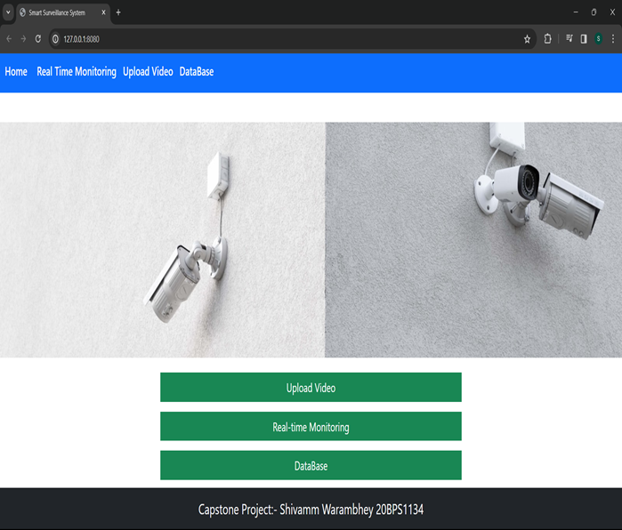
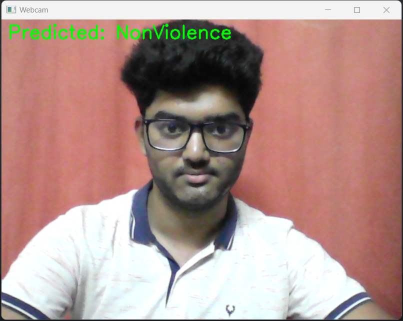
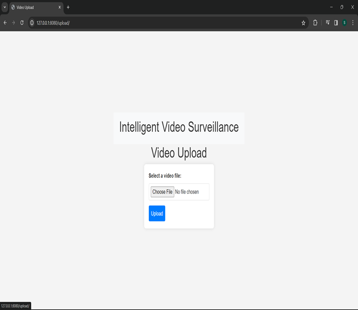
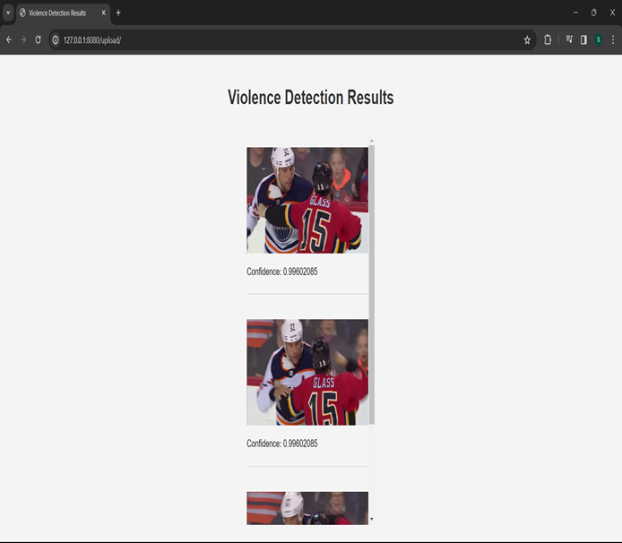
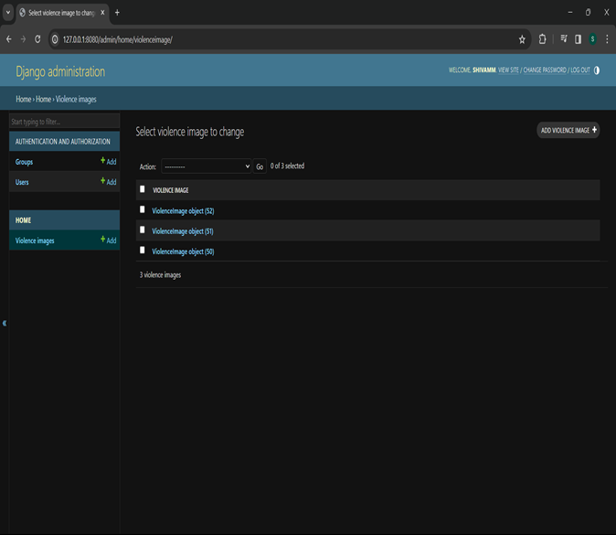
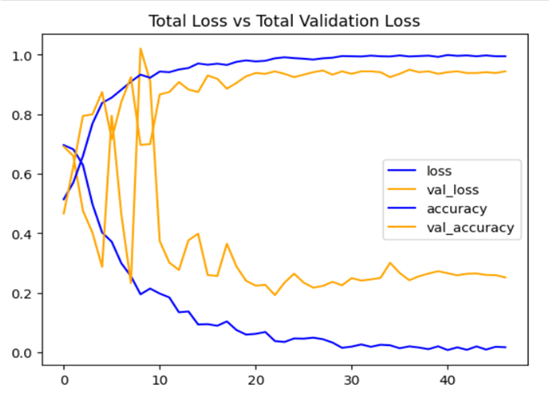
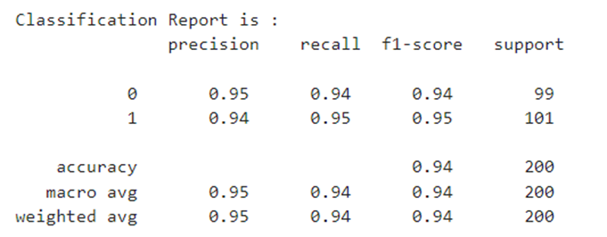
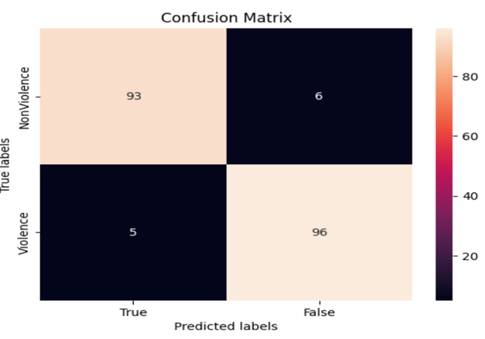

# Anomaly-Detection-in-Surveillance-Systems

This project is one part of my final year project of my B.Tech. based on Anomaly Detection in Surveillance Systems. This specific part focuses on violence detection, where videos and real-time streams are analyzed to classify scenes as either violent or non-violent. The system leverages deep learning models to accurately detect and highlight violent incidents in surveillance footage.

The model architecture integrates MobileNetV2 as a feature extraction backbone combined with a Bi-LSTM layer for temporal sequence analysis. This combination allows the system to efficiently process both spatial and temporal information from video frames. The system achieves high accuracy in distinguishing violent and non-violent scenarios, with a focus on scalability and real-time performance.

The system also includes a Django-based web interface, which provides an intuitive platform for users to upload videos for analysis or monitor real-time violence detection using a webcam feed. Detected incidents are stored in a database for further review, enabling comprehensive surveillance management.

This project demonstrates the practical application of deep learning in surveillance systems, offering an automated approach to anomaly detection with the potential to enhance public safety and security monitoring systems.

## 1. Django Webpage and Features
The Django-based web application acts as the core interface for the Violence Detection System. It integrates seamlessly with the machine learning model to offer features like video upload analysis, real-time monitoring, and database management. Design ensures that users can efficiently detect and analyze anomalies in surveillance footage.

### 1) User Interface

The home page serves as the central hub for navigation where users can choose between Uploading video for analysis, Perform real-time monitoring and Access stored records in the database.

### 2) Real-Time Monitoring

The real-time monitoring feature enables live detection of violent activities using a connected webcam. The system streams the video, applies the ML model in real-time, and overlays predictions on the live feed.

### 3) Upload Video for Analysis

This feature allows users to upload video files directly through the web interface. The system processes these videos frame by frame using the trained CNN-BiLSTM model and predicts whether the content contains violent activities. Users can review the predictions, which are displayed alongside frames from the video with confidence scores

### 4) Database Integration

The system is equipped with a database to store analyzed video data. Each detection event is logged into the database with details like File name or source of the video, Predicted label, Confidence score of the prediction, Timestamp for each analyzed frame.

## 2. Violence Detection Model
The violence detection model employs a MobileNetV2 Convolutional Neural Network (CNN) as the backbone for feature extraction, followed by a Bi-LSTM (Bidirectional Long Short-Term Memory) network for analyzing temporal sequences of frames in a video. This architecture effectively combines spatial and temporal feature learning to detect violent incidents accurately.

MobileNetV2 is fine-tuned for this task by unfreezing the last 40 layers, enabling the model to adapt to the specific features of violence-related scenes. The Bi-LSTM further enhances the detection by capturing the context between consecutive frames, making the system robust for real-world video streams.

The dataset used for training consists of labeled violence and non-violence video clips. These videos are pre-processed into frame sequences and normalized before being fed into the model. The training process optimizes the model's parameters to achieve high accuracy and low validation loss.

### 1) Accuracy and Loss Graph

### 2) Classification Report

### 3) Confusion Matrix

